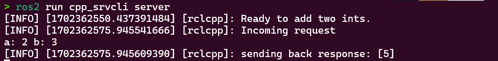
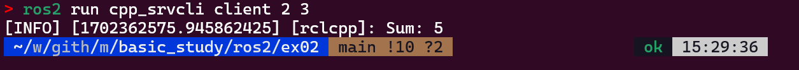

# ROS2

- [ROS2 humble](https://docs.ros.org/en/humble/index.html)

## ROS2 참고

- 패키지 리스트 확인

```bash
ros2 pkg list
```

- 실행 중인 node 리스트 확인

```bash
ros2 node list
```

## windows + wsl2

- ROS2 개발 환경
  - 윈도우 11
  - WSL2
  - Ubuntu 22.04
  - zsh

### Install

#### set locale

```bash
locale  # check for UTF-8

sudo apt update && sudo apt install locales
sudo locale-gen en_US en_US.UTF-8
sudo update-locale LC_ALL=en_US.UTF-8 LANG=en_US.UTF-8
export LANG=en_US.UTF-8

locale  # verify settings
```

#### Add apt repository

```bash
sudo apt install software-properties-common
sudo add-apt-repository universe

sudo apt update && sudo apt install curl -y
sudo curl -sSL https://raw.githubusercontent.com/ros/rosdistro/master/ros.key -o /usr/share/keyrings/ros-archive-keyring.gpg

echo "deb [arch=$(dpkg --print-architecture) signed-by=/usr/share/keyrings/ros-archive-keyring.gpg] http://packages.ros.org/ros2/ubuntu $(. /etc/os-release && echo $UBUNTU_CODENAME) main" | sudo tee /etc/apt/sources.list.d/ros2.list > /dev/null
```

#### tools

```bash
sudo apt update && sudo apt install -y \
  python3-flake8-docstrings \
  python3-pip \
  python3-pytest-cov \
  ros-dev-tools
  
sudo apt install -y \
   python3-flake8-blind-except \
   python3-flake8-builtins \
   python3-flake8-class-newline \
   python3-flake8-comprehensions \
   python3-flake8-deprecated \
   python3-flake8-import-order \
   python3-flake8-quotes \
   python3-pytest-repeat \
   python3-pytest-rerunfailures
```

#### install ros2

```bash
sudo apt-get install ros-humble-desktop-full
```

#### dependencies using rosdep

```bash
sudo apt-get upgrade

sudo rosdep init
rosdep update
rosdep install --from-paths src --ignore-src -y --skip-keys "fastcdr rti-connext-dds-6.0.1 urdfdom_headers"
```

#### sh setup

```bash
echo "source /opt/ros/foxy/setup.bash" >> ~/.zshrc
```

## package

```bash
ros2 pkg create --build-type ament_cmake [package-name]
```

## example node

### ex1

[ex1](https://docs.ros.org/en/foxy/Tutorials/Beginner-Client-Libraries/Writing-A-Simple-Cpp-Publisher-And-Subscriber.html)

#### build

```bash
cd [project-dir]
rosdep install -i -from-path src --rosdistro humble -y
colcon build --packages-select cpp_pubsub
# zsh install/setup.zsh
./install/setup.sh
```

### ex2

[ex2](https://docs.ros.org/en/foxy/Tutorials/Beginner-Client-Libraries/Writing-A-Simple-Cpp-Service-And-Client.html)

#### make package

```bash
ros2 pkg create --build-type ament_cmake cpp_srvcli --dependencies rclcpp example_interfaces
```

- 패키지가 'cpp_srvcli'라는 이름으로 생성됨

#### write Source code

- 소스코드 작성

#### how to build

```bash
# path : project/
rosdep install -i -from-path src --rosdistro --humble -y
colcon build --package-select cpp_srvcli
# colcon build --packages-select cpp_srvcli --symlink-install --cmake-args -DCMAKE_BUILD_TYPE=Release # when cannot found package using "ros2 run"
```

```bash
source install/setup.bash
# somtimes error
cd install
./setup.sh
```

#### active

```bash
ros2 run cpp_srvcli server
```

```bash
ros2 run cpp_srvcli client 2 3
```

- result

```bash
# 2 + 3 
5
```

#### result

- server



- client



### ex 3

[using parameters in a class](https://docs.ros.org/en/iron/Tutorials/Beginner-Client-Libraries/Using-Parameters-In-A-Class-CPP.html#)

#### build

```bash
rosdep install -i -from-path src --rosdistro --humble -y
colcon build --package-select cpp_parameters
# colcon build --packages-select cpp_parameters --symlink-install --cmake-args -DCMAKE_BUILD_TYPE=Release # when cannot found package using "ros2 run"
```

#### setup

```bash
source install/setup.bash
cd install
source setup.bash
```